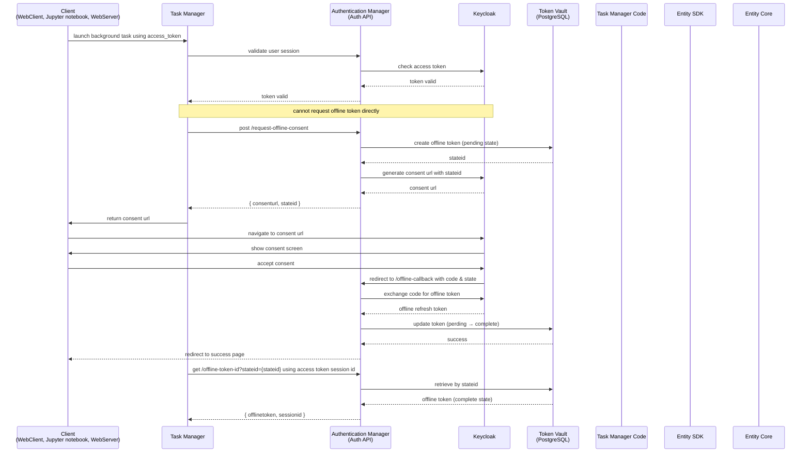

# Offline Token Flow Diagram

This diagram illustrates the complete flow of offline token management in the Task Manager system.

## Flow States

### Offline Token States

- **PENDING**: Token requested but user hasn't completed consent
- **COMPLETE**: User accepted consent, token is ready for use
- **REVOKED**: Token has been revoked and deleted

## Key Components

- **Client**: WebClient, Jupyter notebook code, or WebServer that initiates tasks
- **Task Manager**: Orchestrates background task execution
- **Authentication Manager**: Auth API that manages token lifecycle
- **Keycloak**: Identity provider handling OAuth2/OIDC flows
- **Token Vault**: PostgreSQL-based encrypted token storage
- **Task Manager Code**: Background job execution code
- **Entity SDK**: SDK used by tasks to access Entity Core
- **Entity Core**: Backend API requiring authenticated access

## Key Endpoints

1. **POST /api/auth/manager/request-offline-consent** - Initiate consent flow (returns consentUrl + stateId)
2. **GET /api/auth/manager/offline-callback** - Handle Keycloak callback after consent
3. **GET /api/auth/manager/offline-token-id** - Retrieve token by stateId or sessionId
4. **POST /api/auth/manager/access-token** - Exchange offline token for access token
5. **POST /api/auth/manager/revoke-offline-token** - Revoke and cleanup token

## Security Notes

- Offline tokens cannot be requested directly - consent flow is mandatory
- Offline tokens are stored encrypted in PostgreSQL Token Vault
- State IDs track the consent flow from request to completion
- Session IDs are used by running tasks to retrieve their offline tokens
- Tokens are automatically revoked when jobs complete
- Access tokens are refreshed automatically when expired during task execution
