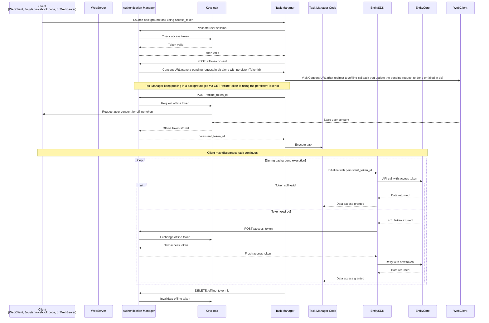
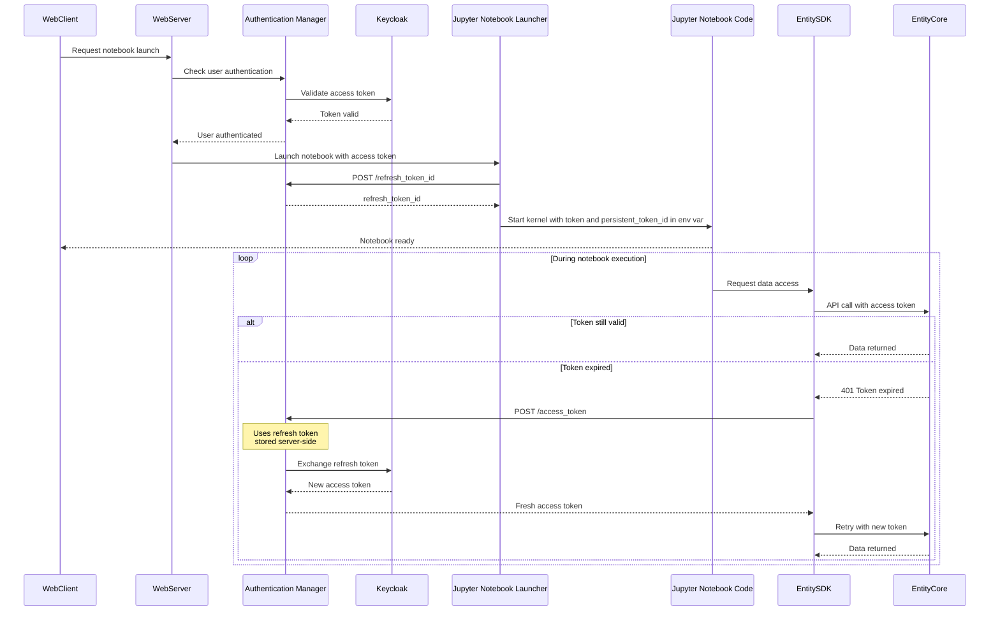

### Task Manager Flow

```mermaid
sequenceDiagram
    participant Client as Client<br/>(WebClient, Jupyter notebook code, or WebServer)
    participant WebServer
    participant AuthManager as Authentication Manager
    participant Keycloak
    participant TaskManager as Task Manager
    participant TaskCode as Task Manager Code
    participant EntitySDK
    participant EntityCore

    %% Client submits a task
    Client->>TaskManager: Launch background task using access_token
    TaskManager->>AuthManager: Validate user session
    AuthManager->>Keycloak: Check access token
    Keycloak-->>AuthManager: Token valid
    AuthManager-->>TaskManager: Token valid

    %% TaskManager request an offline token for the job
    TaskManager->>AuthManager: POST /offline-consent
    AuthManager->>TaskManager: Consent URL (save a pending request in db along with persistentTokenId)
    TaskManager->>WebClient: Visit Consent URL (that redirect to /offline-callback that update the pending request to done or failed in db)
    Note over AuthManager,TaskManager: TaskManager keep pooling in a background job via GET /offline-token-id using the persistentTokenId
    TaskManager->>AuthManager: POST /offline_token_id
    AuthManager->>Keycloak: Request offline token
    Keycloak->>Client: Request user consent for offline token
    WebClient-->>Keycloak: Store user consent
    Keycloak-->>AuthManager: Offline token stored
    AuthManager-->>TaskManager: persistent_token_id
    TaskManager->>TaskCode: Execute task

    Note over Client,EntityCore: Client may disconnect, task continues

    loop During background execution
        TaskCode->>EntitySDK: Initialize with persistent_token_id
        EntitySDK->>EntityCore: API call with access token

        alt Token still valid
            EntityCore-->>EntitySDK: Data returned
            EntitySDK-->>TaskCode: Data access granted
        else Token expired
            EntityCore-->>EntitySDK: 401 Token expired
            EntitySDK->>AuthManager: POST /access_token
            AuthManager->>Keycloak: Exchange offline token
            Keycloak-->>AuthManager: New access token
            AuthManager-->>EntitySDK: Fresh access token
            EntitySDK->>EntityCore: Retry with new token
            EntityCore-->>EntitySDK: Data returned
            EntitySDK-->>TaskCode: Data access granted
        end
    end

    %% Job Termination
    TaskManager->>AuthManager: DELETE /offline_token_id
    AuthManager->>Keycloak: Invalidate offline token

```

### Notebook Refresh Flow

```mermaid
sequenceDiagram
    participant WebClient
    participant WebServer
    participant AuthManager as Authentication Manager
    participant Keycloak
    participant JupyterLauncher as Jupyter Notebook Launcher
    participant JupyterKernel as Jupyter Notebook Code
    participant EntitySDK
    participant EntityCore

    %% Initial login and notebook launch
    WebClient->>WebServer: Request notebook launch
    WebServer->>AuthManager: Check user authentication
    AuthManager->>Keycloak: Validate access token

    Keycloak-->>AuthManager: Token valid
    AuthManager-->>WebServer: User authenticated
    WebServer->>JupyterLauncher: Launch notebook with access token
    JupyterLauncher->>AuthManager: POST /refresh_token_id
    AuthManager-->>JupyterLauncher: refresh_token_id
    JupyterLauncher->>JupyterKernel: Start kernel with token and persistent_token_id in env var
    JupyterKernel-->>WebClient: Notebook ready

    %% Runtime token refresh during notebook execution
    loop During notebook execution
        JupyterKernel->>EntitySDK: Request data access
        EntitySDK->>EntityCore: API call with access token

        alt Token still valid
            EntityCore-->>EntitySDK: Data returned
        else Token expired
            EntityCore-->>EntitySDK: 401 Token expired
            EntitySDK->>AuthManager: POST /access_token
            Note over AuthManager: Uses refresh token<br/>stored server-side
            AuthManager->>Keycloak: Exchange refresh token
            Keycloak-->>AuthManager: New access token
            AuthManager-->>EntitySDK: Fresh access token
            EntitySDK->>EntityCore: Retry with new token
            EntityCore-->>EntitySDK: Data returned
        end
    end

```
